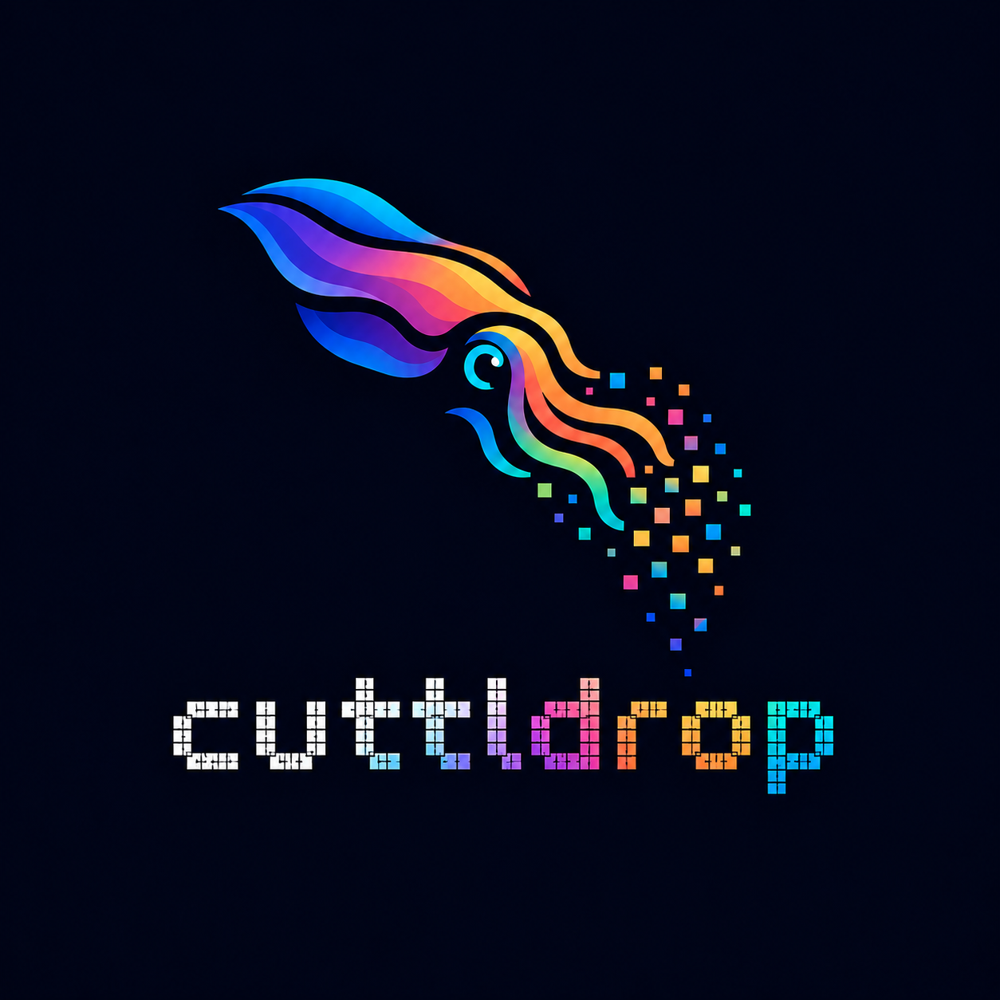

<p align="center">
  
</p>

<p align="center">
  <b>Move a file between two devices that share no network path.</b><br>
  No wifi, no bluetooth, no server, no pairing, no account.<br>
  The only thing crossing the gap is light.
</p>

---

One device — the **skin** — renders the file as a rapidly refreshing stream of QR
frames. The other — the **eye** — points its camera at that screen and rebuilds the
file, hash-verified. Cuttlefish strobe colour across their skin at roughly 10 Hz; the
physics here lands at nearly the same rate, and the RGB mode even strobes colour.

## Status

**Works across a real screen-to-camera air gap. Still alpha: known bugs remain.**

| | |
|---|---|
| Transport: RaptorQ fountain, per-packet CRC gate, periodic manifest | done |
| Mandatory BLAKE3 verify — files arrive named, typed, hash-checked | done |
| Adaptive compression (raw DEFLATE only when it pays) | done |
| QR ladder: fixed v27/v35/v40, L and hardened-M rungs, bundled ZXing reader | done |
| RGB mode: three standard symbols multiplexed into R/G/B per frame | done |
| RGB calibration: five-patch strip, measured 3×3 crosstalk inverted per frame | done |
| Tiled mode: 2×2 grid of independent symbols, alone or × RGB | done |
| Optical seam test: every packet write → ZXing → ingest, all rungs, in Node | done |
| **A real file across a real air gap** | **done — works across real devices; bugs remain** |

The transport now works over a real camera and display. It is still an alpha: the
remaining bugs and device-specific limits need more physical testing before relying on
it for important files.

## Try it

```sh
cd web && npm install && npm run cert && npm run dev
```

Open `/skin.html` on the sending device and `/eye.html` on the receiving one, and match
the eye's receiver mode to the skin's profile before starting the camera.

- `npm run cert` is **not optional** if either device is a phone — `navigator.mediaDevices`
  only exists in a secure context, so without TLS the eye page loads fine and has no camera.
- Open the address Vite prints under `Network:` **with the `https://`** — a bare
  `192.168.x.x:5173` tries http and looks exactly like "server isn't on the network".
- The self-signed certificate warning is expected; accept it once per device (or install
  `mkcert` and `npm run cert` uses it, warning-free).

### Without a second device

```sh
cargo test --workspace     # framing, fountain, manifest, BLAKE3 — native
cd web && npm test         # the same through wasm-bindgen, plus the optical seam:
                           # every packet rasterized, ZXing-decoded, reingested
```

The browser has a one-machine mode too: open both pages in separate windows and press
**Read a window instead** — the eye reads the skin's window over `getDisplayMedia`
through the entire real pipeline. What it cannot exercise is the optics: perspective,
glare, rolling shutter, and above all the screen-subpixel-to-Bayer-filter colour
crosstalk hanging over the RGB mode. That is why the readout says `screen`, not `camera`.

## How it works

This is a communications problem wearing a graphics costume.

```
skin:  file → useful compression → fountain → framing → QR writer → screen
eye:   camera → ZXing decode → CRC gate → fountain → restore → BLAKE3 → file
```

**A fountain code repairs erasures, not errors** — and a camera pointed at a screen
produces both. The **CRC gate** behind the QR decoder is the load-bearing piece: it
converts whatever survives into a clean accept-or-erase decision, the one thing the
fountain can actually repair. The **BLAKE3 check** at the end is the only statement
about the *file*: its hash rides in the manifest (every 8th packet through the head of
the loop, every 24th after, with the filename and mime type), and nothing is handed
back until the reconstruction matches. The manifest is also why the eye can say
*"receiving cuttlefish.pdf — 2.4 MB"* a second after it starts looking.

**The RGB mode multiplexes three standard symbols into one frame's colour channels** —
JAB Code's colour thesis on unmodified standard-QR geometry. Function patterns coincide
across same-version symbols, so finders stay black and ZXing reads each separated
channel as an ordinary QR code; a channel ruined by crosstalk costs one packet, never
the frame. Crosstalk gets two escalating answers: each channel is contrast-stretched
against in-frame references, and past ~25% leak — where channels *reorder* and no
per-channel transform survives — the **calibration strip** under every RGB symbol lets
the eye measure the screen-to-sensor mixing matrix and invert it per frame, bootstrapping
without a single decoded packet. The seam test drives both: 20% leak falls to the
stretch, 30% defeats it and is undone by the strip.

**The tiled mode climbs density the other way**: not a bigger symbol, more small ones. A
2×2 grid of v27 symbols carries nearly double a single v40's payload, but each tile
locates and decodes alone — glare across one corner costs that corner's packets, never
the frame — and the grid composes with RGB for twelve packets per refresh.

**The eye sheds load rather than queueing it.** ZXing runs in a small pool of workers
behind a single stream-state sink; frames cross as transferred bitmaps with the pixel
readback done off the page's thread, and a frame captured while every decoder is busy is
simply dropped. A rateless stream has no packet you cannot afford to miss.

**No network also means no confidentiality.** Any camera with line of sight can read the
screen. This design buys the absence of a network path — not privacy. Passphrase
encryption is planned.

## Numbers

Payload per frame is exact; the rates are arithmetic at each rung's default sender
frequency, **not** measured optical throughput — settling that is what the eye's goodput
readout exists for.

| Profile | Symbol | Payload/frame | Default rate | Arithmetic ceiling |
|---|---|---|---|---|
| QR v27-L | 125 × 125 | 1,432 B | 24 Hz | 34.4 KB/s |
| QR v35-L | 157 × 157 | 2,264 B | 20 Hz | 45.3 KB/s |
| QR v40-L | 177 × 177 | 2,920 B | 15 Hz | 43.8 KB/s |
| RGB v27-L | 125 × 125 × 3 | 4,296 B | 15 Hz | 64.4 KB/s |
| RGB v35-L | 157 × 157 × 3 | 6,792 B | 12 Hz | 81.5 KB/s |
| RGB v40-L | 177 × 177 × 3 | 8,760 B | 10 Hz | 87.6 KB/s |
| Tiled 4 × v27-L | 4 × 125 × 125 | 5,728 B | 12 Hz | 68.7 KB/s |
| Tiled RGB 4 × v27-L | 4 × 125 × 125 × 3 | 17,184 B | 8 Hz | 137.5 KB/s |

Every rung also has a hardened **ECC-M** variant: same geometry, ~24% less payload
(1,088 / 1,776 / 2,296 B per symbol), double the codeword correction — worth it only if
it converts enough rejected frames into accepted ones, which is a question for the
camera. Real goodput will sit below every ceiling; the eye's telemetry is the honest
scoreboard.

## Layout

```
crates/cuttl-codec/   the shared transport — framing, CRC gate, RaptorQ fountain,
                      manifest, BLAKE3 verify. Compiles native and to wasm32.
crates/cuttl-wasm/    wasm-bindgen shim: ReferenceSkin out, ReferenceEye in.
                      No pixels cross this boundary.
web/                  Vite + TypeScript. QR writer (qrcode), reader (zxing-wasm,
                      bundled), camera handling, pacing, UI. No framework.
```

```sh
cargo test --workspace
cargo fmt --all && cargo clippy --workspace --all-targets
cd web && npm test         # JS boundary + optical seam, no browser needed
```

## Prior art

**txqr** — animated QR plus fountain coding; the closest relative.
**decimen-optical-transfer** — the same thesis on the modern browser stack, with a
real-device ~129 KB/s claim; its `qrcode`/ZXing pairing is the direct ancestor of
Cuttldrop's. Cuttldrop differs above the symbol: RaptorQ rather than LT, a CRC gate
ahead of the fountain, a manifest with mandatory BLAKE3.
**JAB Code** (ISO/IEC 23634:2022) — the polychrome symbology line and the inspiration
for the RGB mode; JAB redesigns the symbol around colour, Cuttldrop keeps standard-QR
geometry and lets colour carry extra standard symbols.
**Twibright Optar** — how dense a raster can get before the optics give up.

## License

Apache-2.0. See [LICENSE](LICENSE).
